

	BAHASA PEMROGRAMAN

	PERTEMUAN 9 LIST, TUPLE DAN
DICTIONARY

	Dosen Pengampu : Agung Nugroho, M.Kom

 
	<b>Tugas untuk memenuhi syarat penilain pada Pert-9</b>

	

                 Nama : Jose Fisto

                 NIM : 312010119

                 Kelas : TI.20 A.1

	

	<b>UNIVERSITAS PELITA BANGSA</b>

	<b>FAKULTAS TEKNIK</b>

	<b>TEKNIK INFORMATIKA</b>

	<b>TA 2020 / 2021</b>

# Tugas Praktikum 4 dan Praktikum 5 Di Pertemuan Ke-9
## Latihan 1 - Praktikum 4 - List

Berikut ini merupakan Tugas pada Pertemuan ke 9 Pada Praktikum 4 Tugas untuk membuat List

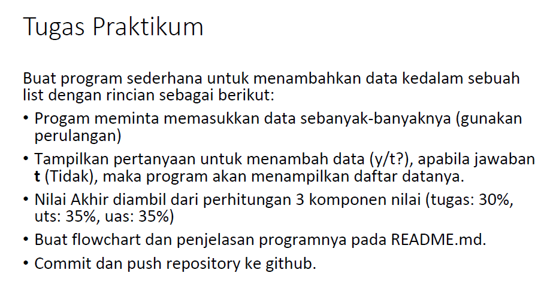

Berikut ini adalah Code Syntaxnya sesuai dengan soal di atas

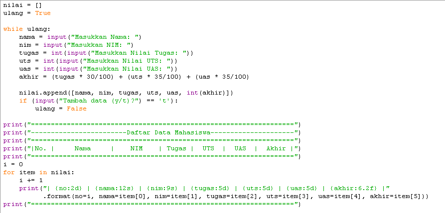

Dengan begitu dapat di jelaskan bahwa :

- `nilai = []` = merupakan inputan data yang akan masuk di data di setiap kondisi dan perulangan

- `ulang = True` = inputan data perulangan while

- `while ulang:` memulai perulangan untuk mengisi daftar data. lalu masukkan data di dalam perulangan while input nama, nim, tugas, uts, uas, akhir dengan kode inputan `nama = input("Masukkan Nama: ")
    nim = input("Masukkan NIM: ")
    tugas = int(input("Masukkan Nilai Tugas: "))
    uts = int(input("Masukkan Nilai UTS: "))
    uas = int(input("Masukkan Nilai UAS: "))
    akhir = (tugas * 30/100) + (uts * 35/100) + (uas * 35/100)`
dan masukkan lagi kode syntax `nilai.append([nama, nim, tugas, uts, uas, int(akhir)])`, Metode **`append()`** yang befungsi untuk menambahkan elemen ke akhir daftar, setelah itu masukkan kondisi `if` di dalam perulangan while untuk menyatakan ya atau tidak dengan kode inputan `if (input("Tambah data (y/t)?") == 't'):`, dan akhiri perulangan while dengan kode inputan `ulang = false`.
- Selanjutnya buat tabel untuk memasukkan data Perulangan While tersebut di dalam tabel dengan kode inputan `print("==================================================================")
print("------------------------Daftar Data Mahasiswa---------------------")
print("==================================================================")
print("|No. |     Nama     |    NIM    | Tugas |  UTS  |  UAS  |  Akhir |")
print("==================================================================")`
- Setelah itu masukkan syntax dengan perulangan for untuk memasukkan data di dalam tabel dengan kode inputan `i = 0
for item in nilai:
    i += 1
    print("| {no:2d} | {nama:12s} | {nim:9s} | {tugas:5d} | {uts:5d} | {uas:5d} | {akhir:6.2f} |"
          .format(no=i, nama=item[0], nim=item[1], tugas=item[2], uts=item[3], uas=item[4], akhir=item[5]))`, fungsi `.format()` untuk pengaturan format string yang akan dicetak atau ditampilkan ke monitor. Fungsi `.format` di syntax ini terdapat parameter format_spec dengan tipe data type yang di liputi dengan variabel.
- Dan syntax terakhir untuk menutupi akhiran tabel print dengan kode inputan `print("==================================================================")`.

Maka hasil yang di keluarkan pada penjelasan di atas akan berupa seperti di gambar di bawah ini.

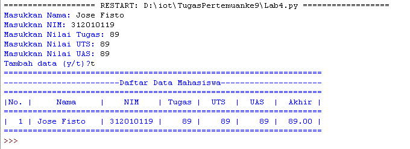

Berikut ini merupakan cara kerja Syntax dan penjelasan dalam bentuk flowchart.

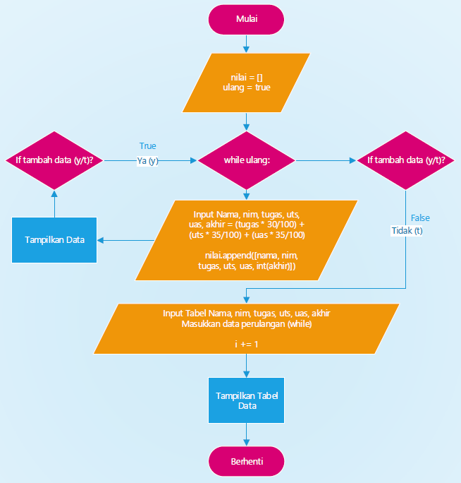

## Latihan 1 - Praktikum 5 - Dictionary

Berikut ini merupakan Tugas pada Pertemuan ke 9 Pada Praktikum 5, Tugas untuk membuat Dictionary 

Berikut ini adalah Code Syntaxnya sesuai dengan soal di atas

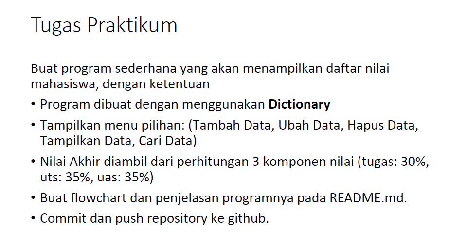

Berikut ini adalah Code Syntaxnya sesuai dengan soal di atas

.png)

.png)

.png)

Dengan begitu dapat di jelaskan bahwa :

- Kode input dibawah ini

    .png) 

    untuk menampilkan output tabel awalan
- `data = {}` untuk memasukkan data input pada setiap menu dictionary
- `while True:` menggunakan perulangan while untuk di setiap menu dictionary untuk menyatakan kondisi true / false.
- lalu masukkan kode inputan dengan variabel L untuk Lihat, T untuk Tambah data, U untuk mengubah data, H untuk hapus data yang telah di inputkan, C untuk Cari data yang sudah di input, K untuk menyelesaikan menu atau berhenti dengan kode inputan .png)
- `if menu.lower() == 'k':
        break` kondisi if untuk memasukkan metode menu pada tabel yang berfungsi untuk keluar dan .lower digunakan untuk mengubah setiap karakter di string menjadi kapital.
- `elif menu.lower() == 'l':` kondisi if elif untuk memasukkan metode menu tabel berfungsi untuk melihat data yang terinput, lalu tampilkan tabel dan data yang telah tersimpan di database dan .lower digunakan untuk mengubah setiap karakter di string menjadi kapital dengan kode inputan .png)
-  `elif menu.lower() == 't':` kondisi elif untuk memasukkan metode menginputkan data secara manual dan .lower digunakan untuk mengubah setiap karakter di string menjadi kapital, 
.png), kode inputan tersebut terdiri dari kondisi elif, perulangan for yang berfungsi untuk memasukkan data kedalam database jika telah masuk ke dalam database maka tabel akan muncul sesuai dengan data yang telah di inputkan ke dalam database.
- `elif menu.lower() == 'u':` kondisi elif digunakan untuk mengubah data yang ada di dalam database dan menampilkan data tersebut dalam bentuk tabel setelah mengubah data dan .lower digunakan untuk mengubah setiap karakter di string menjadi kapital, berikut kode input lanjutan kondisi elif yaitu,
.png)
- `elif menu.lower() == 'c':` kondisi elif yang digunakan sebagai pencarian data yang telah di inputkan ke dalam database jika data sudah di temukan akan menampilkan data secara terurut dengan garis baru yang di mulai dari Nama, Nim, Nilai Tugas, UTS, UAS, dan Nilai Akhir dengan kode inputan, yaitu : 

    .png)
- `elif menu.lower() == 'h':` kondisi elif yang digunakan untuk menghapus data yang ada di dalam database dan .lower digunakan untuk mengubah setiap karakter di string menjadi kapital dengan kode inputan 

    .png)

Berikut ini adalah output layar yang di tampilkan sesuai dengan kode syntax dan penjelasan di atas :

1. Menapilkan output data tabel

    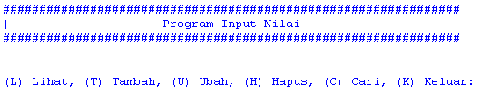
2. Data tabel untuk menginputkan data mahasiswa ke database
   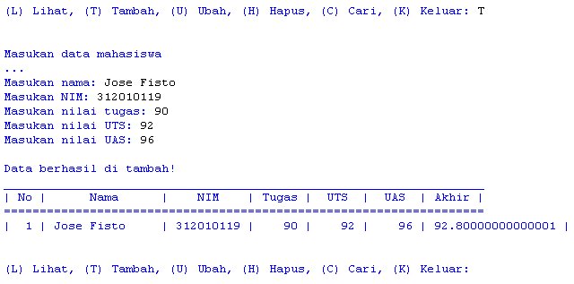
3. Menampilkan Output data yang telah di simpan di database
   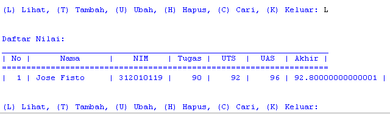
4. Mengubah data yang telah di simpan pada database
   
   .png)
   
   Mengubah NIM Mahasiswa
   
   .png)
   
   Mengubah Nilai Tugas Mahasiswa
   
   .png)
   
   Mengubah Nilai UTS Mahasiswa
   
   .png)
   
   Mengubah Nilai UAS Mahasiswa
   
   .png)
5. Mencari data mahasiswa yang telah tersimpan di database
   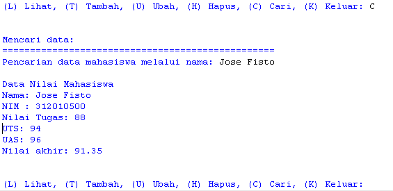
6. Menghapus data mahasiswa yang telah tersimpan di database
   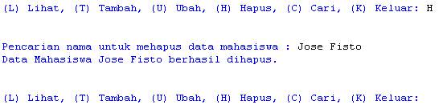
7. Keluar atau selesai dari menu tabel tersebut
   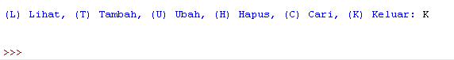

Dan di bawah ini merupakan penjelasan dan syntax yang telah di jelaskan sebelumnya dalam bentuk Flowchart

.png)
***Lanjutan dari flowchart pertama***
.png)

## Sekian dari saya terima kasih
